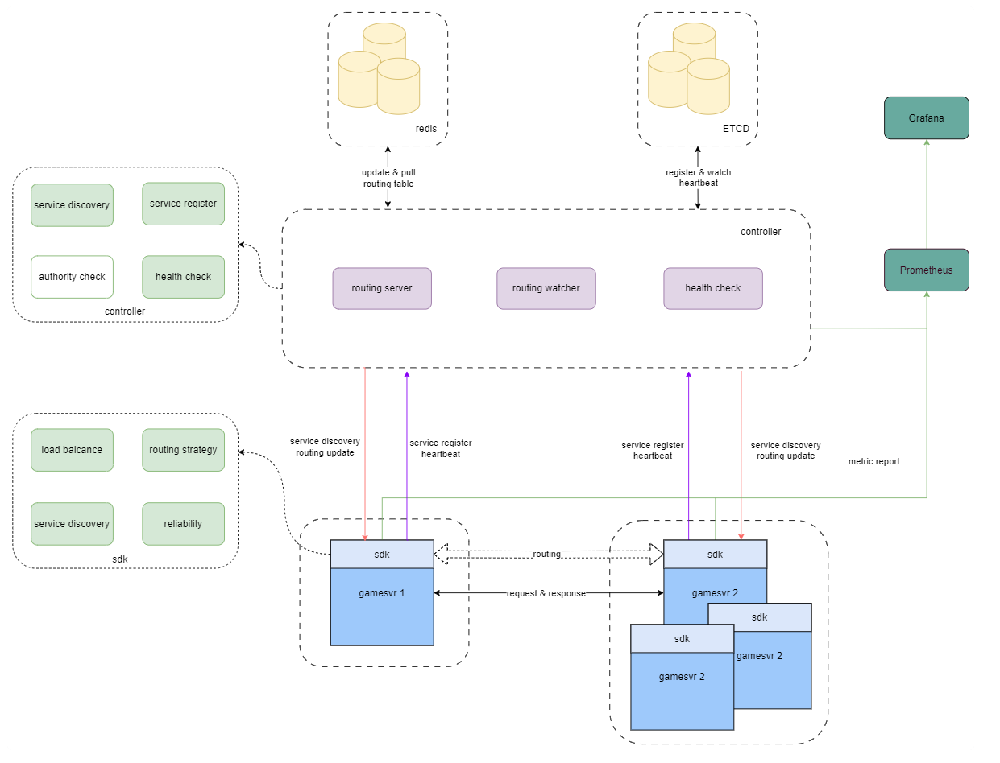

# mini-router

## 1. 简介
mini-router是一个路由服务框架。采取了类似istio的控制面和数据面的思想，在控制面划分了三个微服务，实现了包括路由注册、心跳保活、服务发现、路由变更等功能，在控制面设计了两套sdk，分别供服务主调方和被调方使用，具有低侵入、低资源占用、优雅停止等特点。

## 2. 架构图


### 2.1 控制面组成
* etcd：作为服务发现的中枢，维护被调方的心跳，并在心跳到期或者有新的key加入时向注册的节点广播通知；
* redis：存储路由表，将较大的路由表划分为多个更小粒度的hash表，可以利用redis的hash操作更便捷地增删改查路由表；
* routing server：与主调方sdk通信，在sdk启动时下发完整的路由表，并建立grpc流式连接，向所有连接的sdk广播路由表的变化；
* routing watcher：通过watch etcd中的心跳前缀key来监听节点的变化，并向redis中更新路由表；
* health check：与被调方sdk通信，负责为被调方分配唯一id，并向etcd注册被调方的心跳，并定期进行心跳保活。

### 2.2 数据面组成
* 被调方sdk：在本项目中称为`provider`，负责与控制面通信，上报被调方的服务地址，并根据配置的超时时间，持续向控制面发送心跳信息来保活；
* 主调方sdk：在本项目中称为`consumer`，负责与控制面通信，获取被调方的服务地址，支持一致性哈希、随机、指定目标、权重四种基础路由方式，以及键值路由的用户自定义路由方式。

## 3. 使用方法

### 3.1 控制面
```
cd mini-router
./run.sh #启动控制面服务
./stop.sh #停止控制面服务
```
控制面各服务产生的日志记录在`log`文件夹中

### 3.2 被调方sdk 
安装被调sdk包
```
go get git.woa.com/kefuai/mini-router/provider
```

``` 
sdk := provider.NewProvider(configPath)
if err := sdk.Run(); err != nil {
    panic(err)
}
// ... some test ...
sdk.Stop()
```

### 3.3 主调方sdk 
安装主调sdk包
```
go get git.woa.com/kefuai/mini-router/consumer
```

```
// virtualNode为哈希环上的虚拟节点数
sdk, err := consumer.NewConsumer(configPath, virtualNode)
if err != nil {
	panic(err)
}
if err := sdk.Run(); err != nil {
	panic(err)
}
// ... some test ...
sdk.Stop()
```